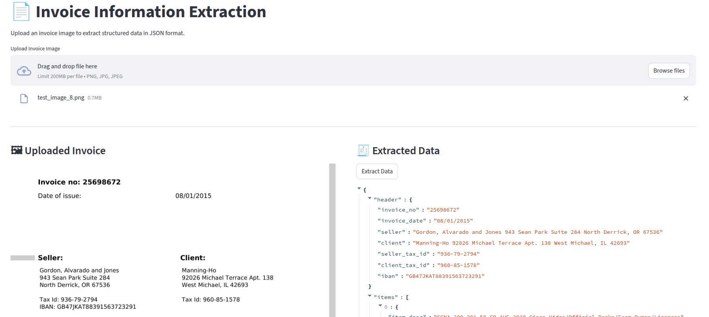

# Invoice Information Extraction

This project addresses the challenge of automatically extracting structured data from invoice images, a common bottleneck in business automation and accounting workflows. Finetuned the Qwen2.5-VL vision-language model specifically for invoice understanding, enabling robust extraction of key fields in the invoice . The solution leverages state-of-the-art multimodal AI to convert unstructured invoice images into machine-readable JSON, streamlining downstream processing and analysis.

## Features
- Upload invoice images (PNG, JPG, JPEG)
- Extracts data from invoices
- Outputs structured JSON data
- Powered by a fine-tuned [Qwen2.5-VL model](https://huggingface.co/Adarsh203/qwen-2.5-vl-3b-invoices)
- Streamlit web interface
- Docker and docker-compose support for easy deployment

## Requirements
- Python 3.10+
- [Hugging Face account & access token](https://huggingface.co/settings/tokens)
- (Optional) Docker & docker-compose

## Setup Instructions

### 1. Clone the Repository
```bash
git clone git@github.com:Lucifer203/Invoice-Generation.git
cd Invoice-Generation
```

### 2. Create a `.env` File
Create a `.env` file in the project root with your Hugging Face token:
```ini
HUGGINGFACE_TOKEN=your_huggingface_token_here
```

### 3. Install Python Dependencies (Local Setup)
It is recommended to use a virtual environment:
```bash
python3 -m venv myvenv
source myvenv/bin/activate
pip install --upgrade pip
pip install -r requirements.txt
```

### 4. Run the Application (Locally)
```bash
streamlit run main.py --server.port=8051
```
Visit [http://localhost:8051](http://localhost:8051) in your browser.

---

## Docker Setup

### 1. Build and Run with Docker Compose
```bash
docker-compose up --build
```
The app will be available at [http://localhost:8051](http://localhost:8051).

### 2. (Optional) Standalone Docker
```bash
docker build -t invoice-app .
docker run -p 8051:8051 --env-file .env invoice-app
```

---

## Usage
1. Open the web app in your browser.
2. Upload an invoice image (PNG, JPG, JPEG).
3. Click "Extract Data" to process the image.
4. View the extracted JSON data or raw text.
5. Use the "Reset All" button to clear and upload a new image.

---

## Example Output



---

## Troubleshooting
- **Model Download Issues:** Ensure your Hugging Face token is valid and has access to the model.
- **CUDA/CPU:** The app will use GPU if available, otherwise defaults to CPU.
- **Port Conflicts:** Make sure port 8051 is free or change it in the Dockerfile/compose and run commands.
- **Missing Dependencies:** Double-check `requirements.txt` and install all dependencies.

---

